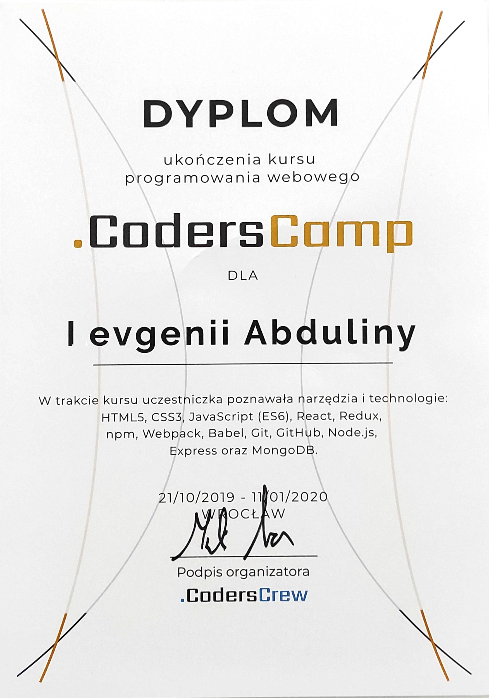
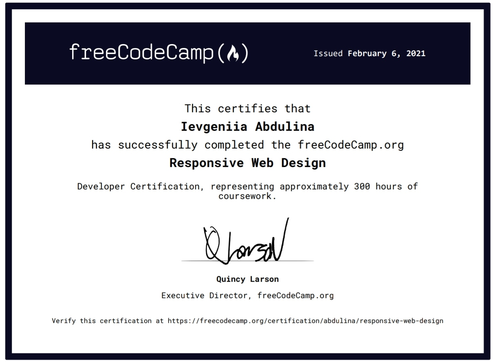
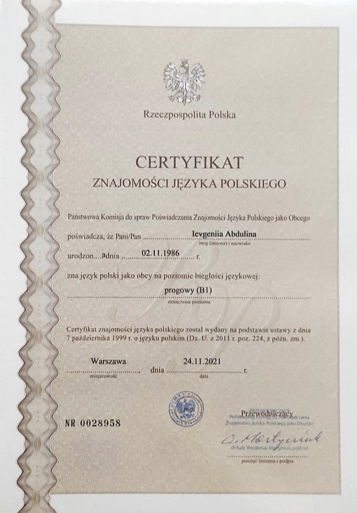
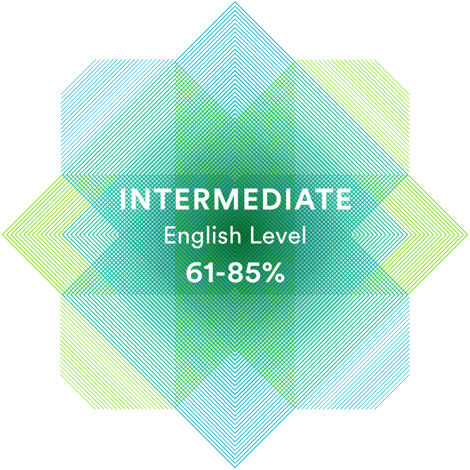

<!-- Junior Developer Resume -->

# <span class="txcolor">Ievgeniia Abdulina</span>
*Front-end Developer*


## <span class="txcolor">Contact Info</span>

- **Phone:** 794 078 554
- **E-mail:** ievgeniiaabdulina@gmail.com
- **Location:** Wroclaw, Poland
- [LinkedIn](https://www.linkedin.com/in/ievgeniiaabdulina)
- [Behance](http://www.behance.net/Jenshen608)
- [GitHub](https://github.com/IevgeniiaAbdulina)


## <span class="txcolor">Summary</span>

Junior Web Developer with experience in developing web applications from scratch - information gathering, planning, design, and development. Started a career road as a web designer. This opportunity gave me a better understanding of how to develop web applications. Extremely motivated to build high-quality solutions. Looking for an opportunity to grow front-end development skills in an innovative environment.


## <span class="txcolor">Skills</span>
<!-- todo: add a simple unordered list -->
    * HTML & CSS
    * Bootstarp, SCSS
    * JavaScript
    * React & Redux, npm
    * Git, GitHub
    * MongoDB
    * VSCode
    * Figma, Illustrator, Adobe Photoshop

## <span class="txcolor">Code examples</span>
*As part of a challenge from [freeCodeCamp.org](https://www.freecodecamp.org), I built the following projects and got all automated test suites to pass:*

* [Palindrome Checker](https://www.freecodecamp.org/learn/javascript-algorithms-and-data-structures/javascript-algorithms-and-data-structures-projects/palindrome-checker):
```js
    function palindrome(str) {
        var regex = /[a-z]|[0-9]+/g;
        var expression = str.toLowerCase().split("").map(elem => elem.match(regex)).join("");
        var reverse = expression.split("").reverse().join("");
        return expression === reverse;
    }

    palindrome("eye");
```

* [Build a Personal Portfolio Webpage](https://www.freecodecamp.org/learn/2022/responsive-web-design/build-a-personal-portfolio-webpage-project/build-a-personal-portfolio-webpage):
```css
    /* === PROJECTS SECTION STYLE === */
    .projects-grid {
        width: 100%;
        height: auto;
        margin-top: 40px;
        display: flex;
        flex-wrap: wrap;
        justify-content: space-evenly;
        gap: calc((100% - (31.5% * 3)) / 3);
    }

    .project-tile {
        height: 100%;
        min-height: 280px;
        min-width: 280px;
        flex: 0 0 31.5%;
        margin: 2rem 0.2rem;
    }

    .project:nth-child(even) .panel-front {
        background-color: var(--light-blue-color);
    }

    .project:nth-child(odd) .panel-front:nth-child(odd) {
        background-color: var(--light-purple-color)
    }
```


## <span class="txcolor">Experience</span>

Welcome to my self-directed learning projects profiles:

- [CODEPEN](https://codepen.io/ievgeniiaabdulina/full/VweMyLM)
- [freeCodeCamp](https://www.freecodecamp.org/abdulina)
- [frontendmentor](https://www.frontendmentor.io/profile/IevgeniiaAbdulina)


Portfolio pages:

- [GitHub](https://github.com/IevgeniiaAbdulinas)
- [linkedIn](https://www.linkedin.com/in/ievgeniiaabdulina)
- [Behance](http://www.behance.net/Jenshen608)


## <span class="txcolor">Education</span>

**The Kharkiv State Technical University**<br>
**of Building and Architecture**<br>
Sep 2004 – Jun 2011<br>
Architecture<br>
Kharkiv, Ukraine

## <span class="txcolor">Courses</span>

**Web Programming Course**<br>
[**CodersCamp**](https://www.coderscamp.edu.pl)<br>
Oct 2019 - Jan 2020<br>
Wroclaw, Poland <!-- todo: add <br> -->
    

**English Language School**<br>
**SpeakUp**<br>
Oct 2018 - Mar 2020<br>
Wroclaw, Poland

## <span class="txcolor">Online learning</span>

- [RS School JavaScript/Front-end course](https://rs.school/js)<br>
JS/FE Course EN 2022Q3 (Stage#1) - _In Progress_

- [freeCodeCamp](https://www.freecodecamp.org/abdulina)
    - [Responsive Web Design](https://www.freecodecamp.org/certification/abdulina/responsive-web-design) <!-- todo: add <br> -->
        
    - [JavaScript Algorithms and Data Structures](https://www.freecodecamp.org/certification/abdulina/javascript-algorithms-and-data-structures)

- [Udemy](https://www.udemy.com): <!-- todo: add <br> -->
    **Modern React with Redux** <!-- todo: add <br>, add link: https://www.udemy.com/course/react-redux/-->
        *Instructor: Stephen Grider* <!-- todo: add <br> -->
        *53% complete*

- YouTube Courses:
    - [The Net Ninja](https://www.youtube.com/c/TheNetNinja) <!-- todo: add  - [HTML ... -->
        -[HTML & CSS Crash Course Tutorial](https://www.youtube.com/playlist?list=PL4cUxeGkcC9ivBf_eKCPIAYXWzLlPAm6G)
        - [Full Modern React Tutorial](https://www.youtube.com/playlist?list=PL4cUxeGkcC9gZD-Tvwfod2gaISzfRiP9d)
    - [Wes Bos](https://www.youtube.com/c/WesBos)
        - [JavaScript30](https://www.youtube.com/watch?v=VuN8qwZoego&list=PLu8EoSxDXHP6CGK4YVJhL_VWetA865GOH])


## <span class="txcolor">Languages</span>

- Ukrainian - Native
- Polish - B1 <!-- todo: add <br> -->
    
- English - B1 / Intermediate <!-- todo: add <br> -->
    
- Russian - Native


<style>
    .txcolor {
        font-weight: bold;
        color: #A107FA;
    }

    a {
        color: #FA14AF;
    }

    img {
        border: 8px solid #FFF;
        border-radius: 4px;
    }
</style>